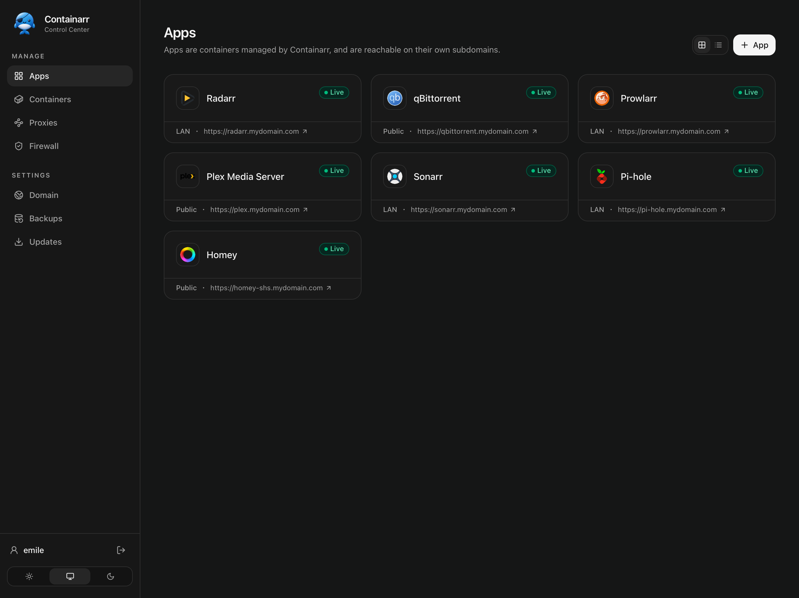

<p align="center">
<a href="#getting-started"></a>
</p>
<h3 align="center">Containarr</h3>
<p align="center">The easiest way to self-host Docker containers on your homelab server!</p>

---

👋 **Welcome to Containarr!** Containarr includes everything you need to:

* Install, run & update Docker containers.
* Access your services securely — for example `https://plex.mydomain.com` and `https://sonarr.mydomain.com`.
* Keep your domain connected with built-in Dynamic DNS. Simply point `*.mydomain.com` to `mydomain.containarr.me` with a CNAME record. HTTPS automatically works!
* Control who can access each service. Make services public or restrict them to specific IP addresses and networks.
* Automatically update containers or receive a notification when an update becomes available.
* Manage everything through a beautiful web interface designed for both desktop and mobile.

> A friendly warning: Containarr is intentionally opinionated, so it may not be for everyone, and that’s perfectly fine. There are plenty of excellent alternatives available.

# Screenshots




[View more screenshots »](https://github.com/Containarr/containarr/tree/main/screenshots)

# Requirements

* A Linux host, e.g. Raspberry Pi
* Port 80 (HTTP) and 443 (HTTPS) available

# Getting Started

## 1. Install Docker

If you haven't installed Docker yet, install it by running:

```bash
$ curl -sSL https://get.docker.com | sh
$ sudo usermod -aG docker $(whoami)
$ exit
```

And log in again.

## 2. Run Containarr

```bash
$ docker run -d \
  --name=containarr \
  --network=host \
  -v ~/.containarr/:/data/ \
  -v /var/run/docker.sock:/var/run/docker.sock \
  --restart unless-stopped \
  ghcr.io/containarr/containarr:latest
```

> 💡 Your settings will be saved in `~/.containarr`.

<details>

  <summary>Alternative: docker-compose.yml</summary>

  ```yaml
  services:
    containarr:
      image: ghcr.io/containarr/containarr:latest
      container_name: containarr
      restart: unless-stopped
      volumes:
        - ~/.containarr:/data
        - /var/run/docker.sock:/var/run/docker.sock
      network_mode: host
  ```
</details>

## 3. Open a Browser

Open http://localhost in your web browser to set-up Containarr, and run your first container.

# Roadmap

- Protect services with `Sign in with Google`.
- Create a native iOS app. _Maybe Android?_
- Create a Command-Line Interface `@containarr/cli`.
- Expand the [Apps Registry](https://github.com/Containarr/registry.containarr.com).

# Architecture

Containarr embeds Traefik, a reverse proxy webserver, that listens on port 80 (HTTP) and port 443 (HTTPS).

```
Internet → Router → Host → Traefik inside Containarr → App
```

For example:

```
https://plex.mydomain.com → Router → 192.168.1.100:443 → Traefik → http://172.17.0.2:32400
```

> Containarr's own web UI listens on `127.0.0.1:81`, and Traefik proxies it on ports 80 and 443.

# Contributing

## Sponsoring

The easiest way to help is to [buy the author a beer](https://github.com/sponsors/WeeJeWel)! 🍻

## Development

At this time, please report any issues, or create small pull requests for bugs you've found.

For new features, please discuss first before opening a pull request to avoid disappointment.
